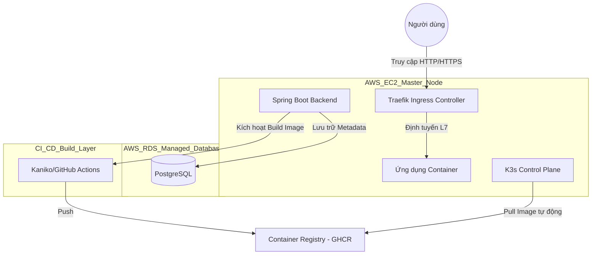
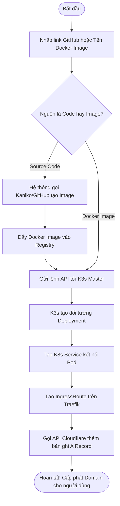
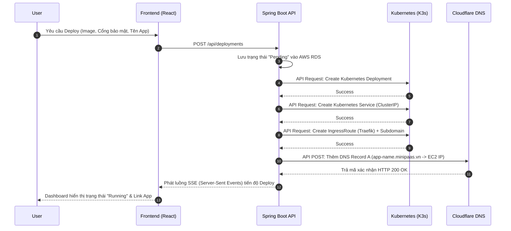

# TÀI LIỆU DỰ ÁN MINIPAAS (NỀN TẢNG ĐIỆN TOÁN ĐÁM MÂY)

## 1. Mục Tiêu Dự Án
- **Xây dựng một nền tảng PaaS (Platform as a Service) thu nhỏ**: Nhằm phục vụ việc tự động hóa hoàn toàn quy trình triển khai ứng dụng web (deploy) từ mã nguồn (.git) hoặc Docker Image.
- **Tối ưu hóa môi trường đám mây**: Thiết kế kiến trúc tối ưu để có thể vận hành ổn định trên các dịch vụ Đám mây có tài nguyên hạn chế về RAM/CPU (như AWS EC2 Free Tier - t2.micro) mà không bị sập (Crash/OOM).
- **Học tập và ứng dụng thực tiễn**: Minh họa thực tế các khái niệm cốt lõi của môn Điện toán Đám mây bao gồm: Ảo hóa Container (Docker), Điều phối tự động (Kubernetes), Software-Defined Network (Tailscale), Cân bằng tải (Traefik) và DNS tự động định tuyến.

---

## 2. Công Nghệ Sử Dụng
- **Hạ tầng Đám mây (IaaS / DBaaS):** AWS EC2 (Compute), AWS RDS (Database Serverless).
- **Điều phối & Ảo hóa (Containerization & Orchestration):** Docker, K3s (Lightweight Kubernetes).
- **Backend:** Java Spring Boot, Kubernetes Client, Server-Sent Events (SSE) để stream log real-time.
- **Frontend:** React.js, Tailwind CSS (hoặc công nghệ UI khác).
- **Mạng lưới & Định tuyến (Networking):** Tailscale (VPN Mesh Layer 3 cho Node), Traefik (L7 Ingress Controller), Cloudflare DNS API (Tự động cấp phát Hostname).
- **CI/CD Build System:** Kaniko / GitHub Actions (để đẩy luồng tải tính toán rác ra khỏi Master node).

---

## 3. System Diagram (Sơ đồ Kiến trúc Hệ thống)

Sơ đồ thể hiện cách các thành phần chính tương tác với nhau trong đám mây AWS.



---

## 4. Use Case Diagram

Các tính năng mà nền tảng cung cấp cho người dùng đầu cuối.

```mermaid
actor User as "Người Dùng (Developer)"

usecase UC1 as "Đăng nhập / Đăng ký"
usecase UC2 as "Tạo dự án / Khởi tạo Deployment"
usecase UC3 as "Theo dõi Log Build (Real-time SSE)"
usecase UC4 as "Cấu hình Biến môi trường (Env)"
usecase UC5 as "Quản lý / Xóa / Tạm dừng ứng dụng"
usecase UC6 as "Scale App (Tăng/giảm pod)"

User --> UC1
User --> UC2
User --> UC3
User --> UC4
User --> UC5
User --> UC6
```

---

## 5. Activity Diagram (Quy trình Triển khai)

Biểu diễn luồng hoạt động từ lúc người dùng nhấn nút "Deploy" cho tới lúc nhận được đường link App sống.



---

## 6. Sequence Diagram (Biểu đồ Tuần tự quá trình Deploy)

Mô tả sự trao đổi thông điệp qua API giữa các hệ thống (Frontend, Backend, K3s, Cloudflare).



---

## 7. Triển Khai Thực Tế Như Thế Nào (Deployment Strategy)

- **Chuẩn bị máy chủ:** Tạo 1 máy ảo AWS EC2 (t2.micro - RAM 1GB).
- **Database:** Tạo cụm PostgreSQL trên dịch vụ AWS RDS (t3.micro) để chịu tải mảng dữ liệu, lấy kết nối chèn vào Spring Boot.
- **Khắc phục phần cứng (AWS Tối ưu hóa):** Phải chủ động cấp phát phân vùng Swap Disk 4GB trên EC2 và giảm `swappiness` bằng Bash Script trước khi chạy K3s để tránh chết máy chủ tức tì.
- **VPN Cấp thấp (Overlay Mesh):** Cài Tailscale trên EC2. Lớp mạng K3s (Flannel) được định cấu hình bằng flag `--flannel-backend=wireguard-native` để giao tiếp ẩn qua Tailscale IP.
- **Triển khai Nền tảng:** Đóng gói Spring Boot và file UI React vào các Image. Áp dụng các file `.yaml` gốc (Role, Ingress, Deployment) lên cụm K3s.
- **Mở luồng Internet gốc:** Mở Port 80 và 443 trên EC2 Security Group. Traefik (được nhúng trong K3s) sẽ lắng nghe gốc trên các port này và phân luồng traffic.

---

## 8. Ưu Điểm Của Hệ Thống

1. **Hiệu suất chi phí (Cost-effective):** Đạt mức tận dụng tài nguyên cực kì triệt để. Kiến trúc bóc tách quá trình xử lý nặng ra ngoài giúp duy trì 1 PaaS ổn định trên nền AWS Free Tier $0.
2. **Khả năng tự động hóa tự thân (Self-service Cloud):** Mọi thứ từ kéo thả image, load balancing, DNS, routing đến bảo mật môi trường đều được tạo lập tự động mà không cần gõ lệnh thủ công.
3. **Mở rộng linh hoạt (Scalability):** Dễ dàng thêm máy chủ khác (bất kỳ hạ tầng nào, Azure hay GCP, hay local) xài chung Tailscale VPN, và gán làm Worker Node của K3s thì cụm có thể thu nạp thêm năng lượng xử lý để deploy thêm hàng trăm ứng dụng khác.

---

## 9. Hướng Phát Triển Tương Lai

1. **Tích hợp SSL/TLS (HTTPS) tự động:** Dùng Let's Encrypt / Cert-manager kẹp vào Traefik cung cấp chứng chỉ HTTPS bảo mật cho mọi dự án của người dùng tải lên.
2. **Theo dõi giám sát (Monitoring/Billing):** Chạy thêm Prometheus và Grafana để có hệ thống biểu đồ đo lường mức độ CPU/RAM người dùng tiêu tốn để áp dụng biểu phí tính tiền (Pay-as-you-go).
3. **Mở quy mô Hybrid Multi-Cloud:** Cho phép kết nối chung các Node từ các đám mây khác (nhà cung cấp Vultr, Google Cloud Platform, Laptop cá nhân) tham gia vào cụm K3s chính chạy trên AWS với Tailscale VPN ở giữa kết dính.
4. **Hệ thống Serverless Function (FaaS):** Cung cấp mô hình Function-as-a-Service, chỉ tính tiền khi có Request theo phong cách AWS Lambda sử dụng các open-source như OpenFaaS.
